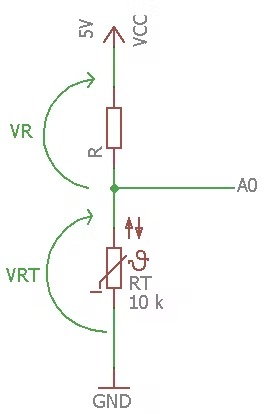

# NTC Thermistor Library

For Arduino and STM32 boards.

The Library implements a set of methods for working with a NTC thermistor.
Provides a temperature reading in Celsius, Fahrenheit and Kelvin.

# How Work
To calculate the thermistor resistance using a simple formula called equation with parameter `B` (with only NTC thermistor).


Where:

`e` is the base of natural logarithm

`R0` is the resistance of the thermistor measured at the temperature T0

`B` is a constant coefficient that depends on the characteristics of the material, it is a constant expressed in K, and its value is indicated by the manufacturers on the technical sheets
To calculate the temperature we need know the resistance RT using the Ohm's laws.



This is a schematic version of circuit.

RT = VRT / (VR/R)

Now we have all the data to calculate the temperature.


Remember to convert all parameters (for example T0) to Kelvin before the calculations, and also the result is in Kelvin.


## Installation Library

1. [Download](https://github.com/hamedsargoli/NTC) the Latest release from gitHub.
2. Unzip and modify the Folder name to "NTC_Thermistor" (Remove the '-version')
3. Paste the modified folder on your Library folder (On your `libraries` folder inside Sketchbooks or Arduino software).
4. Restart the Arduino IDE.

## Circuit Diagram

Connect to the analog side of an Arduino Uno. Run 5V through the thermistor, then a pull-down resistor (R0), and into ground. To measure the temperature pull a line off the junction of the thermistor and the resistor, and into an analog pin (A1 here).


## Methods

```cpp
    // Instantiation:
    /**
        pin - an analog port number to be attached to the thermistor.
        R0 - reference resistance.
        Rn - nominal resistance.
        Tn - nominal temperature in Celsius.
        B - b-value of a thermistor.
    */
    NTC_Thermistor thermistor(pin, R0, Rn, Tn, B);

    // Read a temperature in Celsius.
    double celsius = thermistor.readCelsius();
    // Read a temperature in Kelvin.
    double Kelvin = thermistor.readKelvin();
    // Read a temperature in Fahrenheit.
    double fahrenheit = thermistor.readFahrenheit();
    // For older devices.
    double fahrenheit = thermistor.readFahrenheit();
```

### Examples

[Serial Reading](/examples/SerialReading/SerialReading.ino)

[Average Measurement](/examples/AverageMeasurement/AverageMeasurement.ino)

[Smooth Measurement](/examples/SmoothMeasurement/SmoothMeasurement.ino)

[STM32...](/examples/STM32/STM32.ino)

[All examples...](/examples)

Created by Hamed Sargoli.
